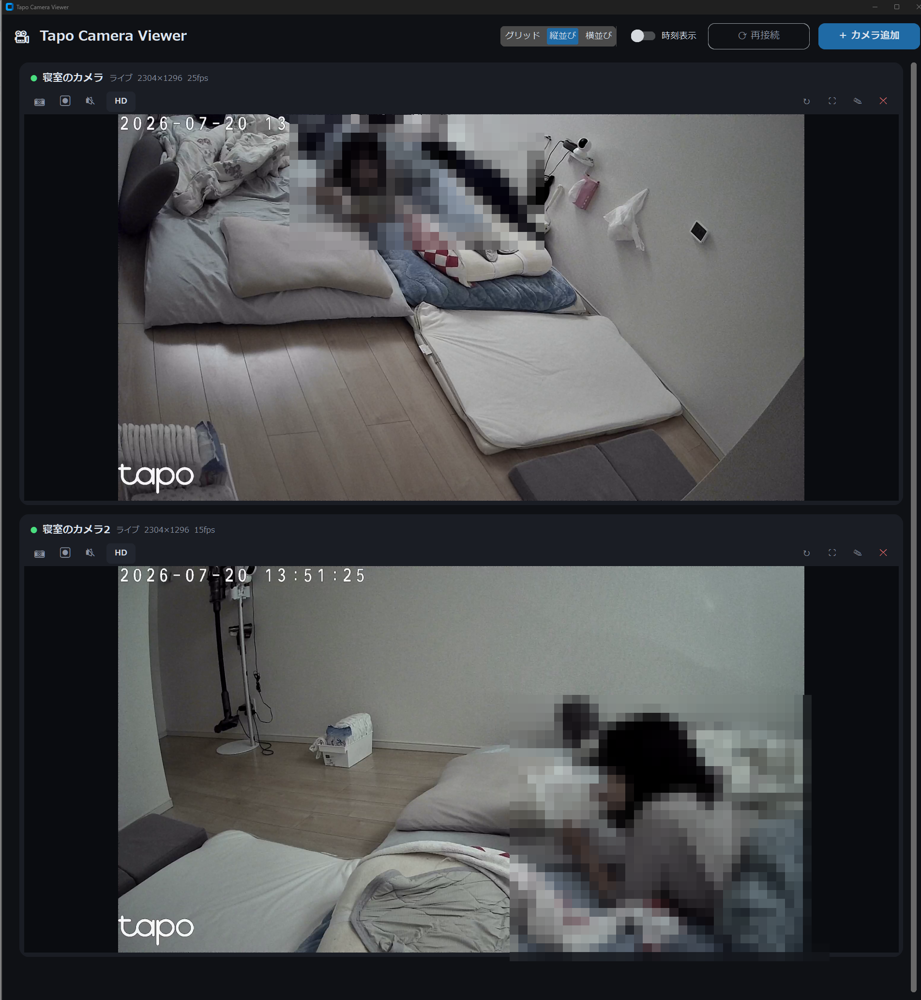

# TapoViewer

**Unofficial Windows viewer for TP-Link Tapo security cameras (RTSP-based, multi-camera live view / recording).**

TapoカメラのRTSPで利用できる機能をすべて詰め込んだWindows 11用ビューアです。フォントはメイリオに統一しています。

> [!NOTE]
> 本プロジェクトはTP-Link社およびTapoブランドとは一切関係のない非公式の個人プロジェクトです。「Tapo」はTP-Link Systems Inc.の商標です。カメラのRTSP機能(公式に公開されているローカルストリーミング機能)を利用しているだけで、Tapoアプリやクラウド機能を代替・改変するものではありません。

## スクリーンショット

## プライバシー・セキュリティについて

- カメラの映像・音声はすべて**同一LAN内のカメラと本アプリ間のRTSP通信のみ**で完結します。外部サーバーやクラウドには一切送信されません
- カメラのIP・ユーザー名・パスワードは `%APPDATA%\TapoViewer\cameras.json` に**平文で**保存されます。共有PCでの利用や、このファイルの取り扱いにはご注意ください
- テレメトリ・アナリティクス・広告SDKの類は組み込まれていません

## 機能一覧

| 機能 | 操作 | 保存先 |
|---|---|---|
| ライブ映像(自動再接続) | 起動するだけ | — |
| HD/SD切替 | カードの「HD/SD」ボタン | 設定に保存 |
| 録画(映像は無劣化、音声付きMP4) | ⏺ボタンで開始 / ⏹で停止 | ビデオ\TapoViewer\ |
| 音声再生(カメラのマイク音声) | 🔊/🔇ボタン(1台ずつ) | — |
| スナップショット | 📷ボタン | ピクチャ\TapoViewer\ |
| 映像回転(90°刻み) | ↻ボタン | 設定に保存 |
| タイムスタンプ表示(OSD) | 上部の「時刻表示」スイッチ(**デフォルトOFF**) | 設定に保存 |
| レイアウト切替 | 上部の「グリッド / 縦並び / 横並び」 | 設定に保存 |
| カードサイズ切替(S/M/L) | 上部の「S / M / L」 | 設定に保存 |
| 保存先の変更 | 上部の「⚙ 設定」→録画・スナップショットの保存フォルダを指定 | 設定に保存 |
| 1画面拡大 | ⛶ボタン or 映像をダブルクリック | — |
| フルスクリーン | F11(Escで解除) | — |

- 縦並びは全カメラを上下1列に表示します。3台以上はスクロールで閲覧できます
- 各カードのステータスに解像度とfpsをリアルタイム表示します
- 録画はffmpegによるストリームコピーのため画質劣化がなく、CPU負荷もほぼゼロです(音声はMP4の仕様上AACに変換)
- タイムスタンプ表示(OSD)はTapo本体が焼き込む時刻表示と重複するため、デフォルトOFF・ONにした場合も右下に表示することで見分けやすくしています

## 事前準備(カメラ側)

1. スマホのTapoアプリでカメラを開く
2. 設定(歯車)→「詳細設定」→「カメラのアカウント」
3. ユーザー名とパスワードを設定して有効化(Tapoアプリのログインアカウントとは別物)
4. カメラのIPアドレスを確認(固定IP推奨)

## セットアップ

### 方法A: exeを直接ダウンロード(推奨・Pythonのインストール不要)

[Releases](../../releases/latest) から最新の **`TapoViewer.exe`** をダウンロードし、好きな場所に置いてダブルクリックするだけです。録画・音声用のffmpegも同梱済みのため、追加インストールは不要です。

### 方法B: ソースからビルド

1. Python 3.10以降をインストール(「Add python.exe to PATH」に必ずチェック)
2. フォルダをダウンロードし、フォルダ内の **`build_exe.bat` をダブルクリック**
3. 完成した **`dist\TapoViewer.exe`** を好きな場所にコピー

前バージョンからの更新の場合(exe再ダウンロード・`build_exe.bat`再実行のどちらでも)、カメラ設定(`%APPDATA%\TapoViewer\`)はそのまま引き継がれます。

## うまく動かないとき

- 映らない: VLCで `rtsp://ユーザー名:パスワード@カメラIP:554/stream1` を開いて切り分け
- 音が出ない: Windowsの既定の出力デバイスを確認。exe再ビルド後も改善しなければ `pip install sounddevice` を実行してスクリプト版(`python tapo_viewer.py`)で切り分け
- 録画ファイルが再生できない: 録画は必ず⏹ボタンで停止してください(強制終了するとMP4のインデックスが書き込まれない場合があります)
- SmartScreen警告: 「詳細情報」→「実行」で起動できます

## サポート

無料・オープンソースで開発しています。広告やテレメトリは入れていないので、便利だと感じたら開発継続のコーヒー代としてサポートいただけると励みになります。

## ライセンス

[MIT License](LICENSE)

## 免責事項

本ソフトウェアは現状有姿(AS IS)で提供され、いかなる保証もありません。防犯・監視用途での利用は自己責任でお願いします。作者はTP-Link社と無関係であり、Tapo製品の仕様変更等により本アプリが動作しなくなる可能性があります。
